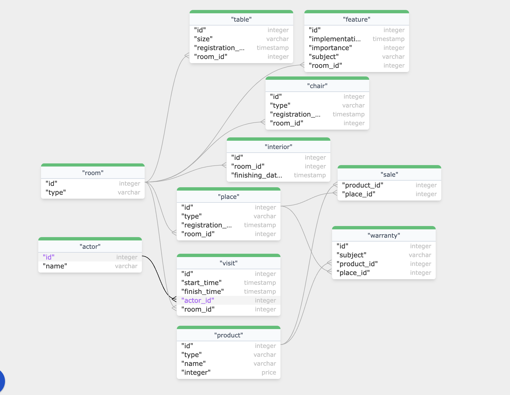

# Лабораторная работа №1 по дисциплине "Информационные системы и базы данных"

**выполнил**: студент группы P33151 Щербаков Александр \
**преподаватель**: Байрамова Хумай Бахруз Кызы

### Взятый за основу предметной области текст:

Залы были заново отделаны со времени его последнего посещения, в них появились некоторые дополнительные удобства.
Маленькие столики со стульями для отдыха, ресторан и почта были тут и раньше, теперь прибавились еще и
парикмахерская, бар, кинотеатр, а также киоск с сувенирами, в котором продавались фотографии и "слайды"
лунных и земных ландшафтови куски "лунников", "рейнджеров" и "сервейоров" с гарантией подлинности,
изящно обрамленные пластиком и грабительски дорогие.

### Сущности и их экземпляры:

Стол: (стержневая)

    маленький столик №1
    маленький столик №2

Стул: (стержневая)

    стул для отдыха №1
    стул для отдыха №2
    стул для отдыха №3
    стул для отдыха №4

Заведение: (стержневая)

    ресторан
    почта
    парикмахерская
    бар
    кинотеатр
    киоск с сувенирами

Товар: (стержневая)

    фотография №1
    фотография №2
    слайд лунного ландшафта №1
    слайд лунного ландшафта №2
    слайд земного ландшафта №1
    слайд земного ландшафта №2
    кусок лунника №1
    кусок лунника №2
    кусок рейнджера №1
    кусок рейнджера №2
    кусок сервейора №1
    кусок сервейора №2

Гарантия: (характеристическая)

    гарантия подлинности

Помещение: (стержневая)

    Зал №1
    Зал №2

Посещение: (ассоциативная)

    Текущее посещение
    Последнее посещение

Отделка: (характеристическая)

    Текущая отделка
    Бывшая отделка

Удобство: (характеристическая)

    Удобство старое
    Удобство новое №1
    Удобство новое №2

### Атрибуты сущностей

    Стол: размер, дата появления 
    Стул: предназначение, дата появления
    Заведение: тип, дата открытия
    Товар: тип, название, обрамление, ощущение цены
    Гарантия: объект гарантии (что гарантируется)
    Помещение: тип
    Посещение: время начала посещения, время конца посещения, посетитель(актор)
    Отделка: дата проведения работ
    Удобство: дата внедрения

### Связи сущностей

    Заведение   М:М Товар
    Товар       М:М Гарантия
    Помещение   1:М Заведение
    Помещение   1:М Отделка
    Помещение   1:М Удобство
    Помещение   1:М Посещение
   

### Инфологическая модель данных

### Даталогическая модель данных

### Выводы

Для реализации модели предметной области бывает полезным эту предметную область изучить и формализовать в виде инфологической модели или хотя бы списка сущностей и их связей. На этой основе можно принимать архитектурные решения задолго до реализации модели в БД и, тем более, накопления большого количества данных, усложняющих миграцию к новым моделям. Такой подход может сэкономить много ресурсов.
