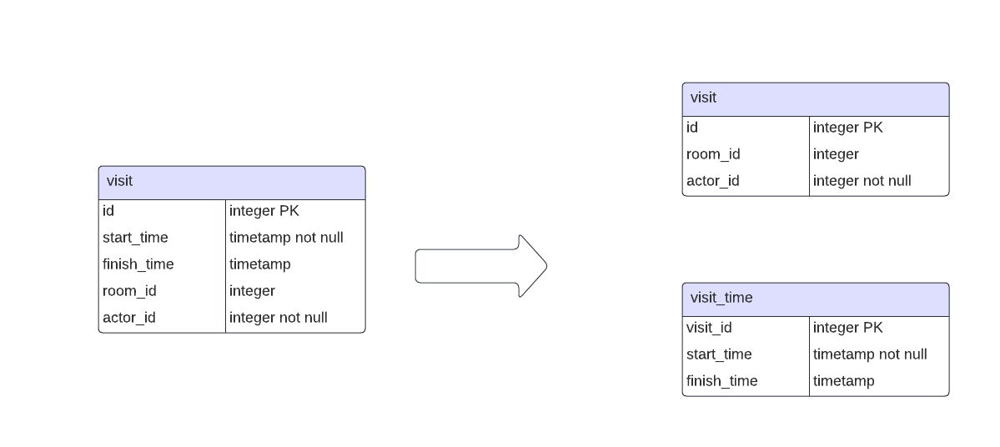
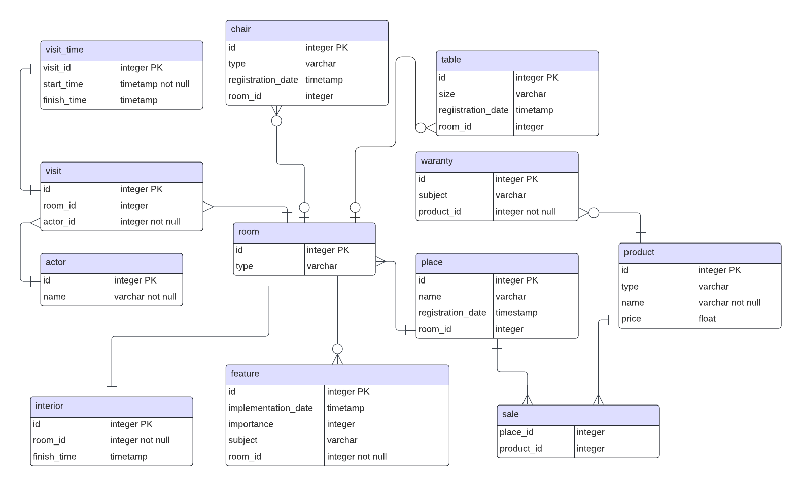
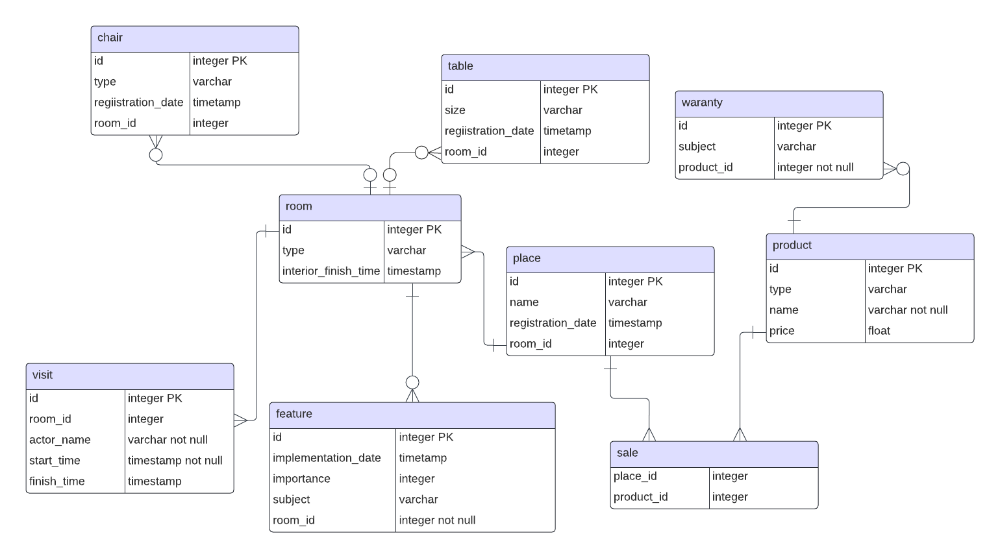

# Лабораторная работа №2 по дисциплине "Информационные системы и базы данных"
**выполнил**: студент группы P33151 Щербаков Александр \
**преподаватель**: Байрамова Хумай Бахруз Кызы 

## Даталогическая модель

## Функциональные зависимости для отношений полученной схемы

очевидно, что все отношения находятся в 1NF. Для того чтобы говорить о том, что отношение находится во второй нормальной форме, достаточно убедиться в том, что:
 - у отношения есть ключ
 - в отношении нет повторяющихся групп (атрибутов с одинаковым смыслом)
 - все атрибуты атомарны

#### table
id, size, date, room_id

в этом отношении полная непосредственная(не транзитивная) функциональная зависимость каждого из атрибутов от первичного ключа

#### chair
id, size, date, room_id

в этом отношении полная непосредственная функциональная зависимость каждого из атрибутов от первичного ключа

#### place
id, name, registration_date, room_id

в этом отношении полная непосредственная функциональная зависимость каждого из атрибутов от первичного ключа

#### product
id, type, name, price

в этом отношении полная непосредственная функциональная зависимость каждого из атрибутов от первичного ключа

#### warancy
id, subject, product_id

в этом отношении полная непосредственная функциональная зависимость каждого из атрибутов от первичного ключа

#### room
id, type

в этом отношении полная непосредственная функциональная зависимость каждого из атрибутов от первичного ключа

#### visit
id, start_time, finish_time, room_id, actor_id

автор работы наивно полагает, что в рамках предметной области или даже рельного мира в известных законах науки о природе, один actor может в один момент времени войти только в одно помещение. А в один момент вромени actor может выйти толькот из одного помещения.

Соответсвенно в этом отношении помимо функциональной зависимости каждого из атрибутов от первичного ключа существует зависимость `id -> start_time, actor_id -> room_id`
а при finish_time!=null допутимы зависимости `id -> start_time, actor_id, room_id -> finish_time`, `id -> finish_time, actor_id -> start_time, room_id`

#### interior
id, room_id, finishing_date

в этом отношении полная непосредственная функциональная зависимость каждого из атрибутов от первичного ключа

#### feature
id, implementation_date, importance, subject, room_id

в этом отношении полная непосредственная функциональная зависимость каждого из атрибутов от первичного ключа

#### actor
id, name

в этом отношении полная непосредственная функциональная зависимость каждого из атрибутов от первичного ключа

## Схема отношения в 3NF 

Для того чтобы избавиться от лишних транзитивных зависимостей в отношении visit можно выделить сущность visit_time в отдельное отношение следующим образом:

тем самым преобразовав нашу схему к форме:

## BCNF

Каждое отношение находится в BCNF, так как детерминанты всех функциональных зависимостей кажого из отношений являются первичными ключами.

## Полезные денормализации

Помимо отката проведенной в предыдущих шагах нормализации можно объеженить отношения room и interior, а также избавиться от отношения actor, перенеся атрибут actor_name в отношение vizit.

Проведенные действия помогут нам избавиться от трех отношений, но перенесут ответсвенность за корректность атрибута actor_name на пользователя.

Денормализация в даннном случаем булет иметь достаточно сомнительную пользу, но будет немного увеличивать скорость доступа к данным. В итоге получим следующую схему:

## Вывод

в процессе выполнения лабораторной работы я больше узнал об анамолиях и процессе нормализации, научился анализировать отношения на предмет разного рода зависимостей атрибутов, проводить нормализацию данных до 3NF и BCNF. 
