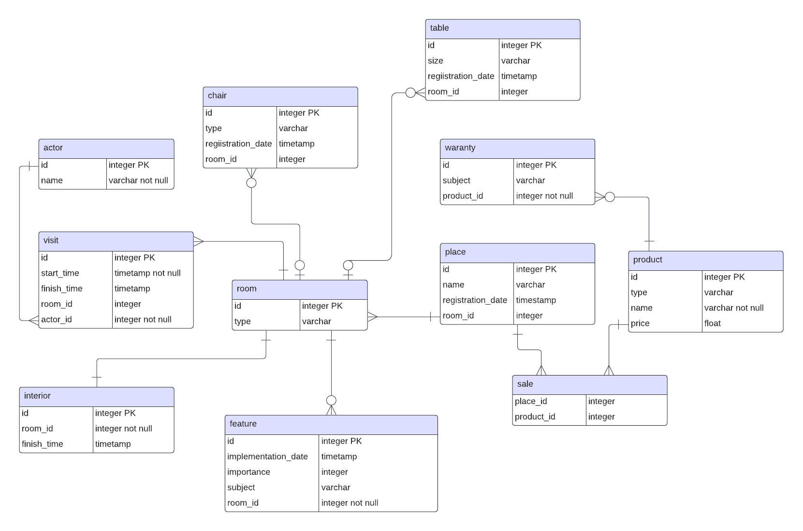

# Лабораторная работа №2 по дисциплине "Информационные системы и базы данных"
**выполнил**: студент группы P33151 Щербаков Александр \
**преподаватель**: Байрамова Хумай Бахруз Кызы 

## Даталогическая модель

## Функциональные зависимости для отношений полученной схемы

## Схема отношения в 3NF 

## BCNF

## Полезные денормализации

