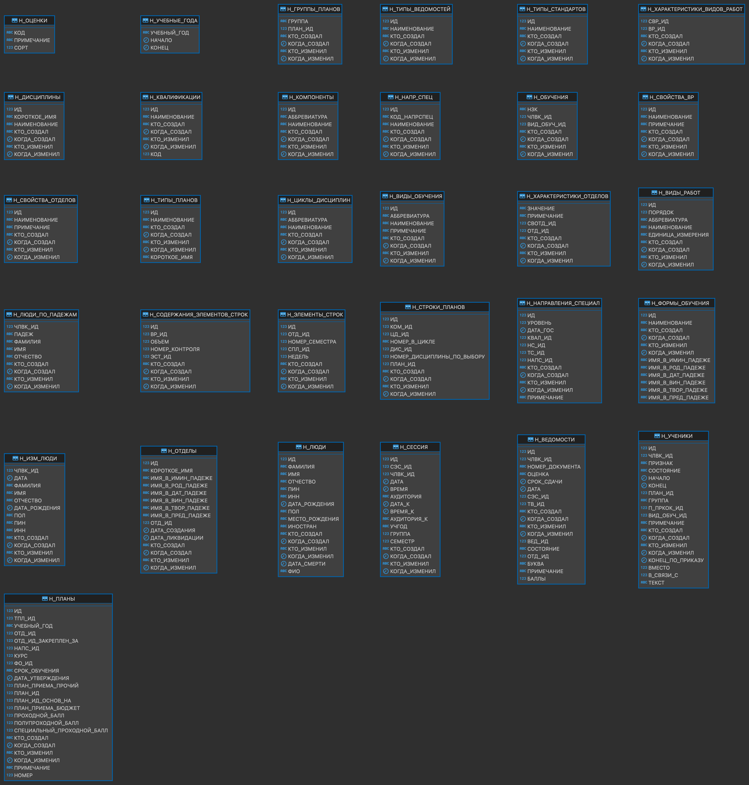

# Лабораторная работа №3 по дисциплине "Информационные системы и базы данных"

выполнил: студент группы P33151 Щербаков Александр\
преподаватель: Байрамова Хумай Бахруз Кызы

Составить запросы на языке SQL (пункты 1-7).

### Схема БД:




1. Сделать запрос для получения атрибутов из указанных таблиц, применив фильтры по указанным условиям:Таблицы: Н_ЛЮДИ, Н_СЕССИЯ.Вывести атрибуты: Н_ЛЮДИ.ИД, Н_СЕССИЯ.ИД.Фильтры (AND):a) Н_ЛЮДИ.ФАМИЛИЯ < Афанасьев.b) Н_СЕССИЯ.ИД = 32199.Вид соединения: LEFT JOIN. 
    - запрос
        
        ```sql
        SELECT Н_ЛЮДИ.ИД, Н_СЕССИЯ.ИД
        FROM Н_ЛЮДИ
            LEFT JOIN Н_СЕССИЯ 
        		ON Н_ЛЮДИ.ИД=ЧЛВК_ИД
        WHERE Н_ЛЮДИ.ФАМИЛИЯ < 'Афанасьев'
        		AND Н_СЕССИЯ.ИД = 32199
        ```
        
2. Сделать запрос для получения атрибутов из указанных таблиц, применив фильтры по указанным условиям:Таблицы: Н_ЛЮДИ, Н_ОБУЧЕНИЯ, Н_УЧЕНИКИ.Вывести атрибуты: Н_ЛЮДИ.ИМЯ, Н_ОБУЧЕНИЯ.ЧЛВК_ИД, Н_УЧЕНИКИ.НАЧАЛО.Фильтры: (AND)a) Н_ЛЮДИ.ИМЯ > Николай.b) Н_ОБУЧЕНИЯ.НЗК < 933232.c) Н_УЧЕНИКИ.ГРУППА > 1100.Вид соединения: RIGHT JOIN.
    - запрос
        
        ```sql
        SELECT Н_ЛЮДИ.ИМЯ, Н_ОБУЧЕНИЯ.ЧЛВК_ИД, Н_УЧЕНИКИ.НАЧАЛО
        FROM Н_ЛЮДИ 
        	RIGHT JOIN Н_ОБУЧЕНИЯ ON Н_ЛЮДИ.ИД = Н_ОБУЧЕНИЯ.ЧЛВК_ИД
        	RIGHT JOIN Н_УЧЕНИКИ ON Н_ЛЮДИ.ИД = Н_УЧЕНИКИ.ЧЛВК_ИД
        WHERE Н_ЛЮДИ.ИМЯ > 'Николай'
        	AND Н_ОБУЧЕНИЯ.НЗК < '933232'
        	AND Н_УЧЕНИКИ.ГРУППА > '1100'
        ```
        
3. Составить запрос, который ответит на вопрос, есть ли среди студентов группы 3102 люди без ИНН.
    - запрос
        
        ```sql
        SELECT CASE 
           WHEN COUNT(*)>0 THEN 'да'
           ELSE 'нет'
           END AS результат
        FROM Н_УЧЕНИКИ
            JOIN Н_ЛЮДИ ON Н_УЧЕНИКИ."ЧЛВК_ИД" = Н_ЛЮДИ."ИД" 
        WHERE Н_УЧЕНИКИ.ГРУППА='3102' 
        	AND Н_ЛЮДИ.ИНН IS NULL
        ```
        
4. Выдать различные фамилии студентов и число людей с каждой из этих фамилий, ограничив список фамилиями, встречающимися менее 50 раз на на заочной форме обучения.Для реализации использовать подзапрос.
    - запрос
        
        ```sql
        SELECT DISTINCT ФАМИЛИЯ, COUNT(*)
        FROM Н_УЧЕНИКИ
            JOIN Н_ЛЮДИ ON Н_УЧЕНИКИ."ЧЛВК_ИД" = Н_ЛЮДИ."ИД" 
        WHERE Н_УЧЕНИКИ.ВИД_ОБУЧ_ИД IN (SELECT ИД 
        				FROM "Н_ФОРМЫ_ОБУЧЕНИЯ" 
        				WHERE Н_ФОРМЫ_ОБУЧЕНИЯ.НАИМЕНОВАНИЕ != 'Заочная')
        GROUP BY ФАМИЛИЯ HAVING COUNT(*)<50;
        ```
        
5. Выведите таблицу со средним возрастом студентов во всех группах (Группа, Средний возраст), где средний возраст больше среднего возраста в группе 3100.
    - запрос
        
        ```sql
        SELECT 
        	ГРУППА, 
        	AVG(EXTRACT(YEAR from age(NOW(), "ДАТА_РОЖДЕНИЯ"))) AS "Средний возраст"
        	
        FROM Н_УЧЕНИКИ JOIN Н_ЛЮДИ ON Н_УЧЕНИКИ."ЧЛВК_ИД" = Н_ЛЮДИ."ИД" 
        GROUP BY Н_УЧЕНИКИ."ГРУППА" 
        HAVING AVG(EXTRACT(YEAR FROM AGE(NOW(), "ДАТА_РОЖДЕНИЯ"))) >
        	(SELCT AVG(EXTRACT(YEAR FROM AGE(NOW(), "ДАТА_РОЖДЕНИЯ")))
        	FROM Н_УЧЕНИКИ JOIN Н_ЛЮДИ ON Н_УЧЕНИКИ."ЧЛВК_ИД" = Н_ЛЮДИ."ИД"
        	WHERE Н_УЧЕНИКИ.ГРУППА = '3100')
        ORDER BY "Средний возраст";
        ```
        
6. Получить список студентов, зачисленных ровно первого сентября 2012 года на первый курс очной формы обучения (специальность: Программная инженерия).
    - В результат включить:
      - номер группы;
      - номер, фамилию, имя и отчество студента;
      - номер и состояние пункта приказа;
      - Для реализации использовать подзапрос с IN.
  
      
   - запрос
        
        ```sql
        SELECT "ГРУППА", "ЧЛВК_ИД", "ФАМИЛИЯ", "ИМЯ", "ОТЧЕСТВО", "В_СВЯЗИ_С", "СОСТОЯНИЕ", Н_УЧЕНИКИ.НАЧАЛО
        FROM "Н_ЛЮДИ"
            JOIN "Н_УЧЕНИКИ" ON "Н_ЛЮДИ"."ИД" = "Н_УЧЕНИКИ"."ЧЛВК_ИД"
            JOIN "Н_ПЛАНЫ" ON "Н_ПЛАНЫ"."ИД" = "Н_УЧЕНИКИ"."ПЛАН_ИД"
            JOIN "Н_ФОРМЫ_ОБУЧЕНИЯ"
                ON "Н_ПЛАНЫ"."ФО_ИД" = "Н_ФОРМЫ_ОБУЧЕНИЯ"."ИД"
                    AND "Н_ФОРМЫ_ОБУЧЕНИЯ"."НАИМЕНОВАНИЕ" = 'Очная'
            JOIN "Н_НАПРАВЛЕНИЯ_СПЕЦИАЛ"
                ON "Н_ПЛАНЫ"."НАПС_ИД" = "Н_НАПРАВЛЕНИЯ_СПЕЦИАЛ"."ИД"
            JOIN "Н_НАПР_СПЕЦ"
                ON "Н_НАПРАВЛЕНИЯ_СПЕЦИАЛ"."НС_ИД" = "Н_НАПР_СПЕЦ"."ИД"
                    AND "Н_НАПР_СПЕЦ".НАИМЕНОВАНИЕ  = 'Программная инженерия'
        WHERE EXISTS(
            SELECT *
            FROM "Н_ПЛАНЫ"
            WHERE "КУРС" = 1 AND "Н_УЧЕНИКИ"."НАЧАЛО" = '2012-09-01'::TIMESTAMP );
        ```
        
8. Вывести список людей, не являющихся или не являвшихся студентами ФКТИУ (данные, о которых отсутствуют в таблице Н_УЧЕНИКИ). В запросе нельзя использовать DISTINCT.
    - запрос
        
        ```sql
        select нл."ИД" , нл."ФАМИЛИЯ", нл."ИМЯ", нл."ОТЧЕСТВО" 
        from "Н_ЛЮДИ" нл
        left join "Н_УЧЕНИКИ" ну on нл."ИД" = ну."ЧЛВК_ИД" 
        where ну.ИД is null
        ```
