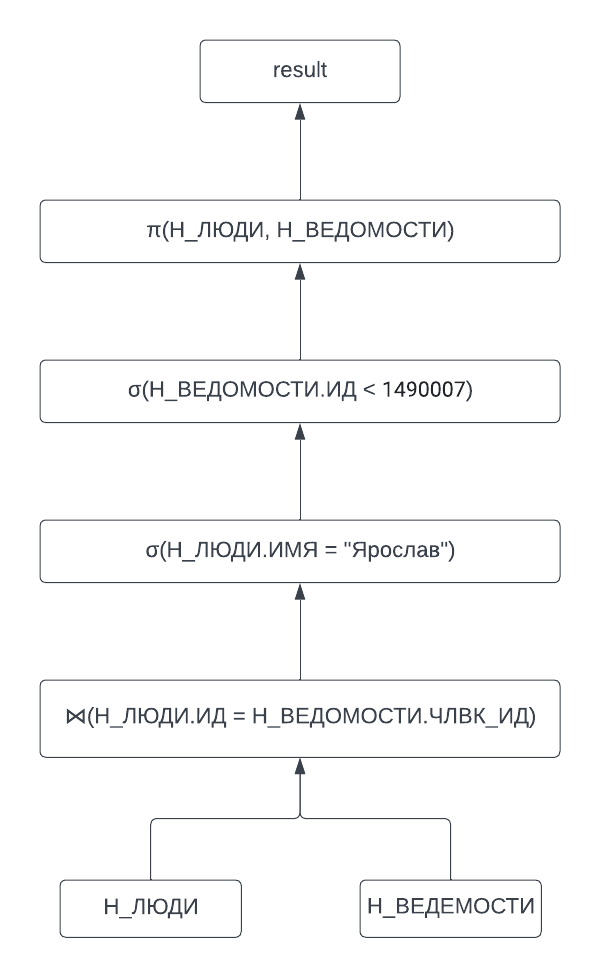

# Лабораторная работа №4 по дисциплине "Информационные системы и базы данных"

выполнил: студент группы P33151 Щербаков Александр\
преподаватель: Байрамова Хумай Бахруз Кызы

Составить запросы на языке SQL (пункты 1-7).
вариант 846532.

### Задание

Составить запросы на языке SQL (пункты 1-2).

Для каждого запроса предложить индексы, добавление которых уменьшит время выполнения запроса (указать таблицы/атрибуты, для которых нужно добавить индексы, написать тип индекса; объяснить, почему добавление индекса будет полезным для данного запроса).

Для запросов 1-2 необходимо составить возможные планы выполнения запросов. Планы составляются на основании предположения, что в таблицах отсутствуют индексы. Из составленных планов необходимо выбрать оптимальный и объяснить свой выбор.
Изменятся ли планы при добавлении индекса и как?

Для запросов 1-2 необходимо добавить в отчет вывод команды EXPLAIN ANALYZE [запрос]

Подробные ответы на все вышеперечисленные вопросы должны присутствовать в отчете (планы выполнения запросов должны быть нарисованы, ответы на вопросы - представлены в текстовом виде).


1. Сделать запрос для получения атрибутов из указанных таблиц, применив фильтры по указанным условиям:
   Таблицы: Н_ЛЮДИ, Н_ВЕДОМОСТИ.
   Вывести атрибуты: Н_ЛЮДИ.ИД, Н_ВЕДОМОСТИ.ИД.
   Фильтры (AND):
   a) Н_ЛЮДИ.ИМЯ = Ярослав.
   b) Н_ВЕДОМОСТИ.ИД < 1490007.
   Вид соединения: INNER JOIN.
2. Сделать запрос для получения атрибутов из указанных таблиц, применив фильтры по указанным условиям:
   Таблицы: Н_ЛЮДИ, Н_ОБУЧЕНИЯ, Н_УЧЕНИКИ.
   Вывести атрибуты: Н_ЛЮДИ.ИМЯ, Н_ОБУЧЕНИЯ.НЗК, Н_УЧЕНИКИ.ГРУППА.
   Фильтры: (AND)
   a) Н_ЛЮДИ.ИМЯ > Александр.
   b) Н_ОБУЧЕНИЯ.ЧЛВК_ИД > 113409.
   c) Н_УЧЕНИКИ.ГРУППА < 1101.
   Вид соединения: RIGHT JOIN.


### Составленные запросы и их QUERY PLAN(EXPLAIN ANALYZE)

```sql
select p."ИД", v."ИД"
from "Н_ЛЮДИ" p 
    inner join "Н_ВЕДОМОСТИ" v on p."ИД" = v."ЧЛВК_ИД"
where p."ИМЯ" = 'Ярослав' and v."ИД" < 1490007
```

План звпроса без индексов: 



| QUERY PLAN |
| :--- |
| Nested Loop  \(cost=0.29..3309.18 rows=739 width=8\) \(actual time=0.194..56.146 rows=554 loops=1\) |
|   -&gt;  Seq Scan on "Н\_ЛЮДИ" p  \(cost=0.00..163.97 rows=17 width=4\) \(actual time=0.162..0.810 rows=17 loops=1\) |
|         Filter: \(\("ИМЯ"\)::text = 'Ярослав'::text\) |
|         Rows Removed by Filter: 5101 |
|   -&gt;  Index Scan using "ВЕД\_ЧЛВК\_FK\_IFK" on "Н\_ВЕДОМОСТИ" v  \(cost=0.29..184.33 rows=68 width=8\) \(actual time=1.604..3.249 rows=33 loops=17\) |
|         Index Cond: \("ЧЛВК\_ИД" = p."ИД"\) |
|         Filter: \("ИД" &lt; 1490007\) |
| Planning Time: 0.413 ms |
| Execution Time: 56.233 ms |


```sql
select p."ИМЯ", o."НЗК", s."ГРУППА"
from "Н_ЛЮДИ" p
    right join "Н_ОБУЧЕНИЯ" o on o."ЧЛВК_ИД"=p."ИД"
    right join "Н_УЧЕНИКИ" s on s."ЧЛВК_ИД"=p."ИД"
where p."ИМЯ" > 'Александр'
    and o."ЧЛВК_ИД" > 113409
    and s."ГРУППА" < '1101'
```

| QUERY PLAN |
| :--- |
| Hash Join  \(cost=819.98..968.71 rows=1210 width=23\) \(actual time=5.808..6.989 rows=1326 loops=1\) |
|   Hash Cond: \(o."ЧЛВК\_ИД" = p."ИД"\) |
|   -&gt;  Seq Scan on "Н\_ОБУЧЕНИЯ" o  \(cost=0.00..119.76 rows=4600 width=10\) \(actual time=0.014..0.917 rows=4608 loops=1\) |
|         Filter: \("ЧЛВК\_ИД" &gt; 113409\) |
|         Rows Removed by Filter: 413 |
|   -&gt;  Hash  \(cost=803.68..803.68 rows=1304 width=25\) \(actual time=5.375..5.377 rows=1309 loops=1\) |
|         Buckets: 2048  Batches: 1  Memory Usage: 97kB |
|         -&gt;  Hash Join  \(cost=240.48..803.68 rows=1304 width=25\) \(actual time=3.982..5.056 rows=1309 loops=1\) |
|               Hash Cond: \(s."ЧЛВК\_ИД" = p."ИД"\) |
|               -&gt;  Bitmap Heap Scan on "Н\_УЧЕНИКИ" s  \(cost=19.66..579.01 rows=1468 width=8\) \(actual time=0.081..0.613 rows=1468 loops=1\) |
|                     Recheck Cond: \(\("ГРУППА"\)::text &lt; '1101'::text\) |
|                     Heap Blocks: exact=184 |
|                     -&gt;  Bitmap Index Scan on "УЧЕН\_ГП\_FK\_I"  \(cost=0.00..19.30 rows=1468 width=0\) \(actual time=0.055..0.055 rows=1468 loops=1\) |
|                           Index Cond: \(\("ГРУППА"\)::text &lt; '1101'::text\) |
|               -&gt;  Hash  \(cost=163.97..163.97 rows=4547 width=17\) \(actual time=3.881..3.882 rows=4547 loops=1\) |
|                     Buckets: 8192  Batches: 1  Memory Usage: 292kB |
|                     -&gt;  Seq Scan on "Н\_ЛЮДИ" p  \(cost=0.00..163.97 rows=4547 width=17\) \(actual time=0.008..3.045 rows=4547 loops=1\) |
|                           Filter: \(\("ИМЯ"\)::text &gt; 'Александр'::text\) |
|                           Rows Removed by Filter: 571 |
| Planning Time: 0.873 ms |
| Execution Time: 7.132 ms |


### Индексы

#### для запроса 1


#### для запроса 2